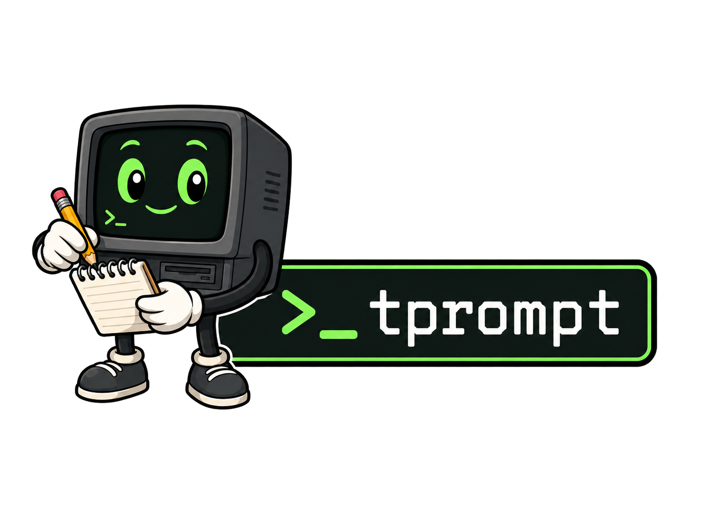
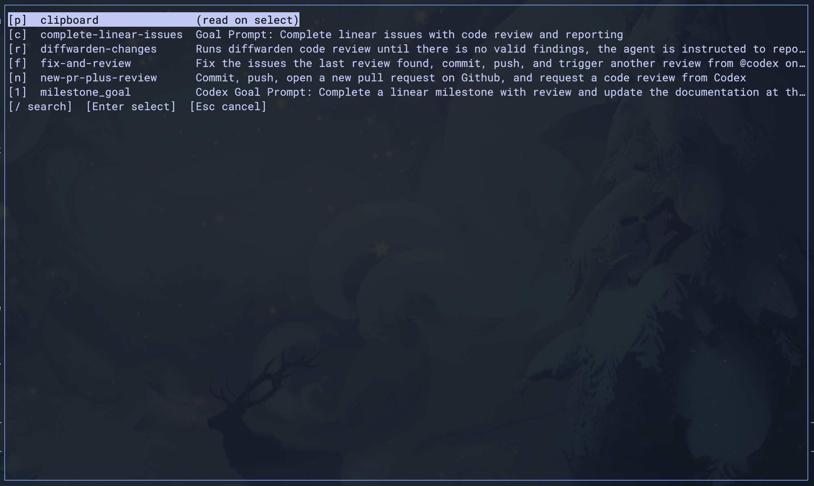

<p align="center">
  
</p>
<p align="center"><em>A tmux-first prompt library that follows you into any pane — every coding agent, REPL, and shell, not locked inside one tool's slash commands.</em></p>

# tprompt

Coding agents lock their saved prompts inside their own slash commands. `tprompt`
keeps yours as plain markdown files and injects the one you pick into whatever is
running in your tmux pane — Claude Code, Codex, aider, a Python REPL, or a bare shell —
as though you typed or pasted it. Author a prompt once; reach for it in any tool, in any
terminal emulator that runs tmux. The main workflow runs in a tmux popup: open the
popup, pick a prompt (or the clipboard), and the text lands in the pane you started
from.

<p align="center">
  
</p>
<p align="center"><em>The prompt board (<code>tprompt tui</code>): pick a prompt by key or arrows, and it injects into the pane you launched from.</em></p>

## Why not just use slash commands or skills?

Saved prompts in a coding agent live inside that one agent. Skills go a step further:
they're designed for the *agent* to invoke on its own. `tprompt` is deliberately the
other way around — a prompt is delivered only when *you* choose it, verbatim, into
whatever is in the pane. Some agents let you gate a command to user-only invocation, but
not all do, and none of them carry that library over to the next tool you open.
`tprompt` gives you one user-driven prompt board that behaves identically across every
agent, REPL, and shell.

Because it rides tmux, it rides your remote sessions too: `tprompt` runs on the host
where tmux runs and reads prompts from that host. SSH into a box, attach to tmux, and
your prompt board is right there — the same "reconnect from any client" persistence you
already expect from tmux, now covering your prompts. (Delivery is verified tmux-targeted
paste; the receiving app still decides how to interpret the text — see
[What tprompt guarantees](#what-tprompt-guarantees).)

**Requirements:** a working `tmux` install on Linux or macOS. Clipboard features
(`tprompt paste` and the TUI clipboard row) use `pbpaste` on macOS (built in) or one of
`wl-paste`/`xclip`/`xsel` on Linux; `send`-only workflows need no clipboard tool.
On Windows, run it inside WSL2 — a Linux environment, so the Linux build applies there.

## Install

Tagged releases ship signed, notarized macOS (Apple Silicon and Intel) binaries
plus Linux x86_64 / arm64 tarballs.

With [Homebrew](https://brew.sh/) (taps
[`aurokin/homebrew-tap`](https://github.com/aurokin/homebrew-tap) and installs
`tmux` as a dependency):

```bash
brew install aurokin/tap/tprompt
```

Or with [mise](https://mise.jdx.dev/) (uses [ubi](https://github.com/houseabsolute/ubi)):

```bash
mise use -g ubi:aurokin/tprompt@latest
```

Or grab a tarball from the [GitHub Releases page](https://github.com/aurokin/tprompt/releases)
and verify it with `shasum -a 256 -c SHA256SUMS` (macOS) or `sha256sum --check SHA256SUMS`
(Linux). See [docs/lifecycle/macos-release-signing.md](docs/lifecycle/macos-release-signing.md)
for signing details, or [Building from source](#building-from-source) for a dev build.

## Quickstart

```bash
# 1. Scaffold a prompt — prints the absolute path of the new file.
tprompt new code-review

# 2. Open it in your editor (paste the path from step 1, or extract it):
$EDITOR "$(tprompt show code-review | sed -n 's/^Source: //p')"

# 3. Confirm it's discovered.
tprompt list

# 4. Send it to your current pane to test directly.
tprompt send code-review
```

`tprompt new` auto-creates the default global prompts directory on first use, so a
fresh install needs no hand-edited config. Pass `--project` to scaffold a per-repo
overlay at `<gitroot>/tprompt/<id>.md` instead.

### Wire up the popup

The popup workflow is the point of `tprompt`. Run `tprompt init` to print the exact
tmux binding — it only prints, and never edits your config:

```bash
tprompt init            # popup binding + install steps
tprompt init --snippet  # just the binding line, to append to a config file
tprompt init --more     # also the direct paste/send bindings
```

The binding it prints looks like:

```tmux
bind-key P display-popup -E "tprompt tui --target-pane '#{pane_id}' --client-tty '#{client_tty}' --session-id '#{session_id}'"
```

After you add it and reload tmux, press **prefix + P**: the prompt board opens in a
popup, you press a prompt's key (or move with `↑`/`↓` and press `Enter`), the popup
closes, and the prompt is injected into the pane you launched it from. See
[examples/tmux-bindings.md](examples/tmux-bindings.md) for the full set, including the
direct paste and send bindings.

## Core Commands

```bash
tprompt new code-review              # scaffold a global prompt
tprompt new project-only --project   # scaffold a per-repo overlay prompt
tprompt import wispr                  # import Wispr Flow snippets as prompts
tprompt list                         # list prompts and their board keys
tprompt show code-review             # print a resolved prompt + metadata
tprompt send code-review             # deliver a prompt to a tmux pane
tprompt paste                        # deliver the clipboard to a tmux pane
tprompt pick                         # choose a prompt via your external picker (fzf)
tprompt tui                          # launch the built-in board
tprompt doctor                       # check environment and config
tprompt init                         # print the tmux popup binding
```

Bare `tprompt` dispatches to `tprompt tui` when stdin is a tty and `$TMUX` is set;
outside tmux it prints help. Full behavior and exit codes:
[docs/commands/cli.md](docs/commands/cli.md).

## Import from Wispr Flow

Already keep a snippet library in [Wispr Flow](https://wisprflow.ai)? Bring it
along. `tprompt import wispr` reads Wispr's local `flow.sqlite` **read-only** and
writes each snippet out as an ordinary markdown prompt — one-way, no sync, your
prompts stay plain files you own.

```bash
tprompt import wispr --dry-run   # preview what would be imported
tprompt import wispr             # import (existing ids are skipped)
tprompt import wispr -i          # pick interactively, conflicts surfaced for review
```

On **macOS** the database is found automatically (you may need to grant your
terminal **Full Disk Access** the first time). On **Linux**, and on **Windows via
WSL2** (there is no native Windows build), point `--db-path` at your `flow.sqlite`
— from WSL2 it lives at `/mnt/c/Users/<you>/AppData/Roaming/Wispr Flow/flow.sqlite`.
Full flags and behavior:
[docs/commands/cli.md](docs/commands/cli.md#tprompt-import-wispr).

## How delivery works

When you pick a row in the TUI, it writes your selection to a private handoff job,
spawns a short-lived worker, and exits. The worker waits until the target pane is
actually ready — real tmux state, not a fixed sleep — then injects. Nothing lands
while the popup is still open, so the brief pause before the prompt appears is
expected, not a failure. Direct `send` and `paste` skip the handoff entirely and
deliver synchronously. Nothing runs as a daemon. For the full data flow, see
[docs/architecture/overview.md](docs/architecture/overview.md).

## What tprompt guarantees

Prompts are plain markdown (frontmatter is metadata; only the body is delivered).
Delivery defaults to bracketed paste, sanitization defaults to `safe`, and `tprompt`
guarantees *verified tmux-targeted delivery* — not that the receiving application
interprets the text as you intended (a shell will; Vim in normal mode may not). The
authoritative contract is [EXPECTATIONS.md](EXPECTATIONS.md).

`tprompt` is intentionally narrow: no templating, no prompt composition, no cross-host
clipboard sync, no GUI. See [EXPECTATIONS.md](EXPECTATIONS.md#non-goals) and
[docs/roadmap/future-phases.md](docs/roadmap/future-phases.md) for what is deliberately
out of scope.

## Documentation

Start at [docs/README.md](docs/README.md) — the progressive-disclosure entrypoint that
routes "I want to change X" to the narrowest doc. Top-level references:

- [EXPECTATIONS.md](EXPECTATIONS.md) — user-visible behavior contract.
- [DECISIONS.md](DECISIONS.md) — locked product and engineering decisions.
- [AGENTS.md](AGENTS.md) — contributor and agent entrypoint (also linked as CLAUDE.md).

## Building from source

```bash
mise install   # pinned Go toolchain + lint/format tooling (see mise.toml)
make build     # version-stamped binary at bin/tprompt
make check     # format check + lint + race-enabled tests (the health gate)
```

For a quick compile check, `go build ./cmd/tprompt`. For the full contributor workflow,
toolchain, and contracts, start at [AGENTS.md](AGENTS.md). Testscripts execute real
`tmux`; see [docs/testing/harness.md](docs/testing/harness.md) before running broad test
targets in a shell with tmux state that matters.
